# Aura

A modern, minimalist firmware for the iPod Classic 6th generation (2008), with its own interface ("Aura UI") built on top of [Rockbox](https://www.rockbox.org/).

`latest release: v0.4.6-beta` · `GPL v2` · `iPod Classic 6G`

## What it is

Aura replaces Rockbox's stock menus, now-playing screen, and themes with a from-scratch UI: cover flow, a lock screen with a passcode, six languages, shared cover art, and settings that follow you when you switch to a sister firmware. The screenshots below are real captures from the SDL simulator that also runs the actual firmware code — the only exception is the boot screen, a design mockup for a bootloader stage the simulator can't run.

This repository is the firmware only. It never talks to your computer directly.

## Install

Install with **[Aura Studio](https://github.com/Ricolinos/Aura-Studio)** — the desktop app that flashes the firmware, manages your library, and keeps everything up to date.

## Highlights

<table>
<tr>
<td width="50%">

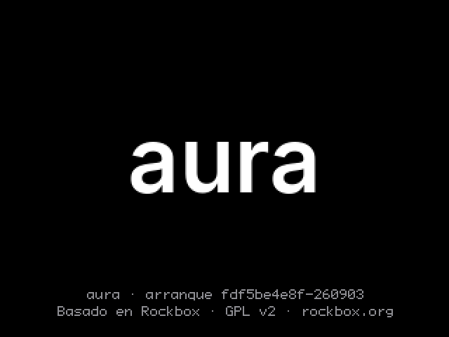
Boot screen mockup for the bootloader stage.

</td>
<td width="50%">

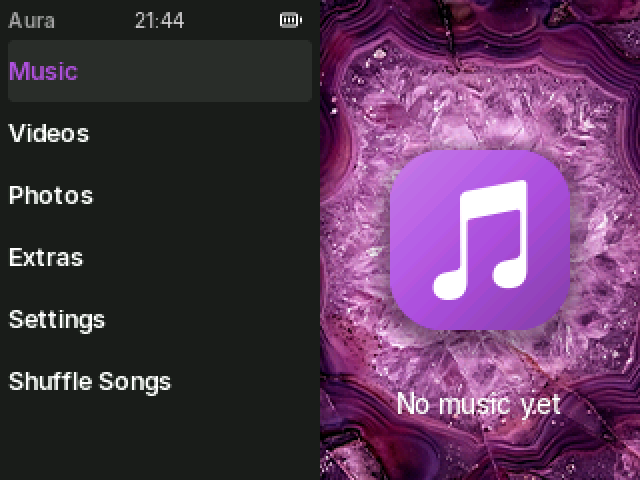
The root menu — Music, Videos, Photos, Extras, Settings.

</td>
</tr>
<tr>
<td width="50%">

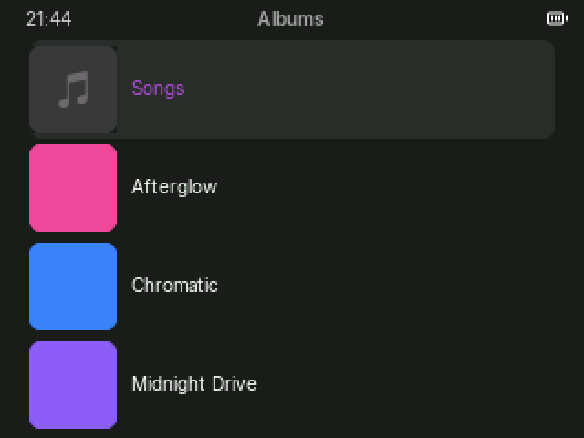
Albums with real cover art, shared across every screen.

</td>
<td width="50%">

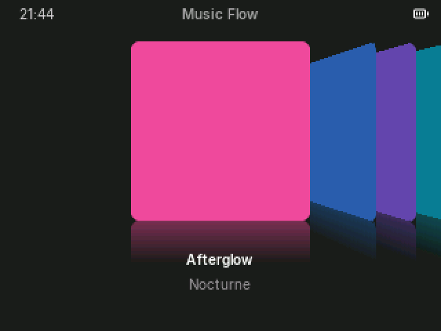
Music Flow — a cover-flow carousel for browsing by album art.

</td>
</tr>
<tr>
<td width="50%">

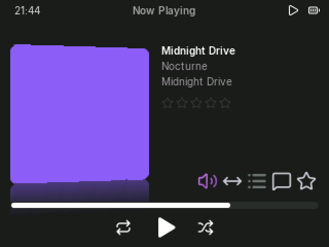
Now Playing — album art, ratings, and playback modes on one wheel.

</td>
<td width="50%">

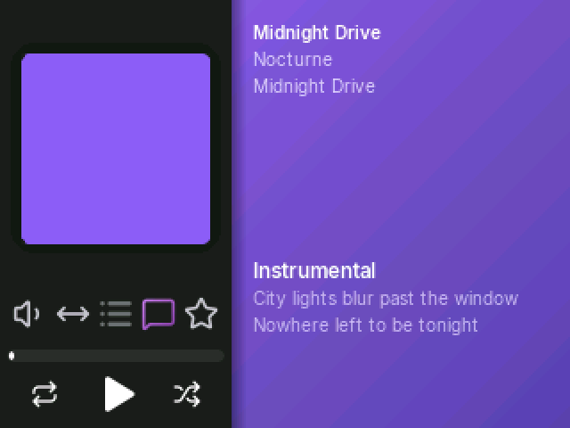
Time-synced lyrics (`.lrc`), one of five Now Playing modes.

</td>
</tr>
<tr>
<td width="50%">

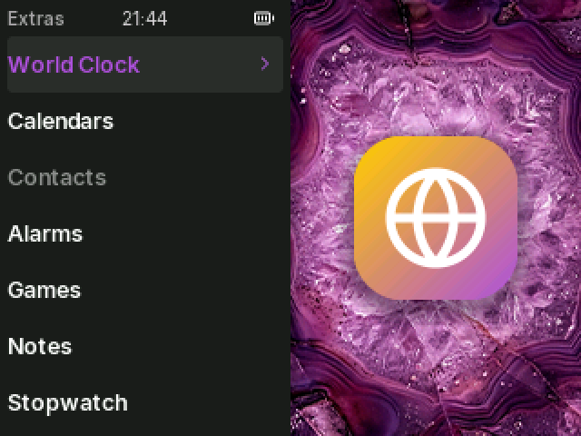
CoverDrift — real album art drifts gently behind ordinary menus.

</td>
<td width="50%">

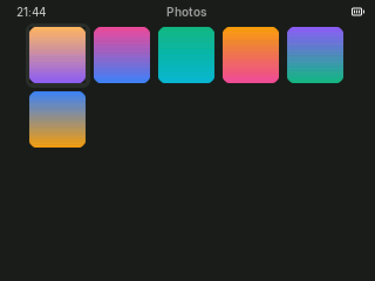
A thumbnail grid for photos, not the old-Rockbox list.

</td>
</tr>
<tr>
<td width="50%">

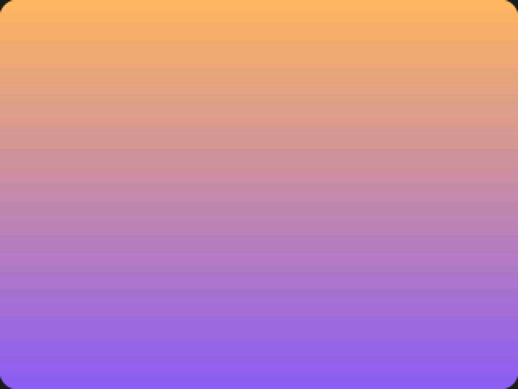
Full-screen photo viewer.

</td>
<td width="50%">

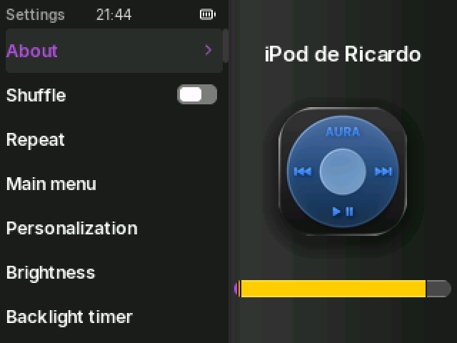
Settings — organized, with live previews instead of raw config keys.

</td>
</tr>
<tr>
<td width="50%">

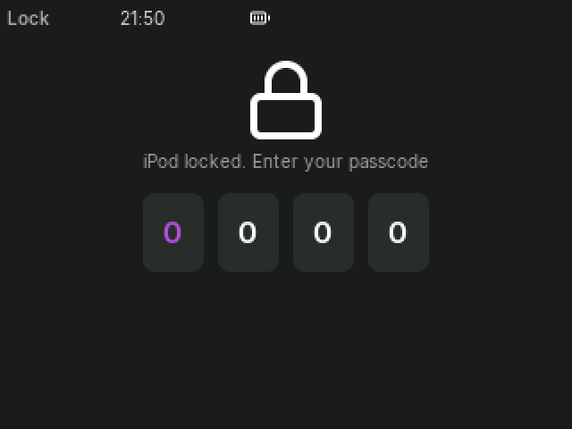
A passcode lock, armed by the Hold switch.

</td>
<td width="50%">

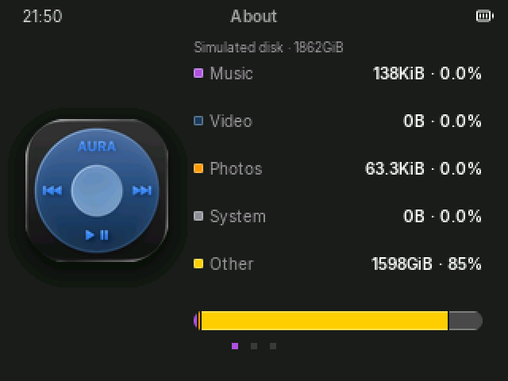
About — a real breakdown of what's using your storage.

</td>
</tr>
<tr>
<td width="50%">

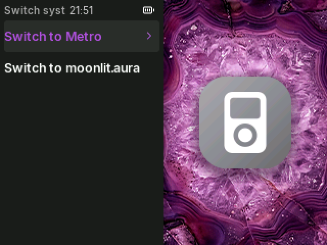
Switch to a sister firmware in a few seconds, no cable required.

</td>
<td width="50%">

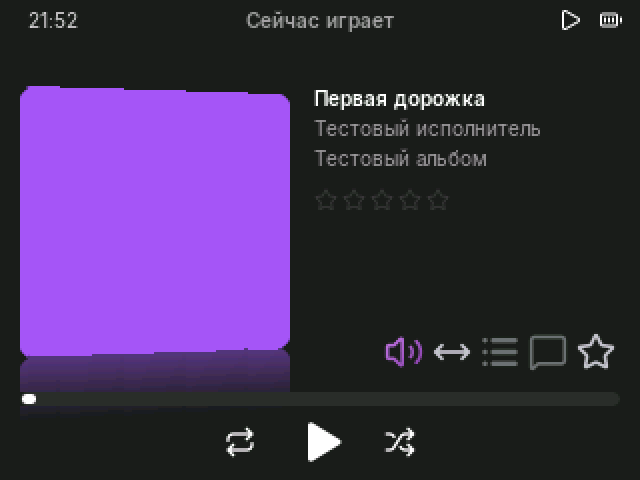
Six languages, including full Cyrillic — here, Russian.

</td>
</tr>
<tr>
<td width="50%">

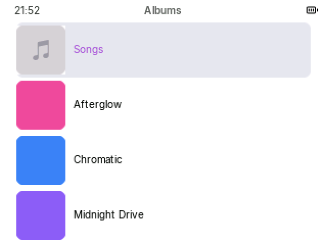
Light theme — every screen supports light and dark.

</td>
<td width="50%">

&nbsp;

</td>
</tr>
</table>

## Features

- **Six languages** — Spanish, English, French, German, Russian, Italian, with full glyph coverage (including Cyrillic) verified mechanically against every font shipped.
- **Shared settings between firmwares** — brightness, backlight timer, auto-off, clicker, volume limit, replaygain, lock (with its passcode), language, and light/dark mode all travel with you when you switch to Metro or moonlit.aura, and back.
- **Selective updates from Aura Studio** — only the files that actually changed are re-copied; a typical update touches a handful of files out of thousands.
- **Shared cover art cache** — album art, artist photos, and playlist covers are decoded once and cached across firmware families, not re-decoded per family.
- **Screen lock with Hold** — arm a passcode lock tied to the Hold switch, with a configurable grace period (immediately, after 1 minute, after 5 minutes, or only at power-on).
- **Installable themes** — a theme is a package of fonts, icons, and a color palette, built and installed from Aura Studio; the compiled-in default is always the fallback, so the device can never end up without a readable interface.
- **Cover flow (Music Flow)** and a **drifting ambient background (CoverDrift)** built from your own library, not stock art.
- **Time-synced lyrics**, ratings, shuffle, repeat, and playlists, all part of the Now Playing wheel of modes.
- **Photo grid and full-screen viewer**, video playback, world clock, alarms, calendar, and the rest of the original iPod's Extras.
- Zero Apple assets: no SF Pro, no SF Symbols. Typography and icons are [Inter](https://rsms.me/inter/) (SIL OFL) and [Lucide](https://lucide.dev/)/[Phosphor](https://phosphoricons.com/) (ISC/MIT).

## Sister firmwares

Aura is one of three firmware families for the iPod Classic 6G, all installable side by side and switchable from Settings → Switch system:

- **[Metro](https://github.com/Ricolinos/Metro-Aura)** — a Windows Phone / Zune-inspired interface.
- **[moonlit.aura](https://github.com/Ricolinos/moonlit-aura)** — a warmer, editorial take on the same hardware.

Switching keeps your library, cover art cache, and shared settings intact — only the interface changes.

## Roadmap

- **Japanese characters** — kana and jōyō kanji, through a glyph cache rather than shipping a full CJK font.
- **More languages**, building on the six already shipped.
- **Photo viewer**: a presentation/slideshow mode, and pan & crop for full-screen photos.
- **Now Playing performance**: the lyrics-mode transition redraws the full screen every frame; an icon cache in RAM is the leading candidate for a real speedup, pending profiling on hardware.
- Broader **hardware verification** — development so far has been on the simulator plus one physical device; more coverage across units is ongoing.

See [`DECISIONS.md`](DECISIONS.md) for the complete, dated log of what's been tried, what worked, and what's still open.

## Building from source

Requirements (macOS, Apple Silicon):

```bash
brew install sdl2 gcc freetype librsvg coreutils gnu-sed make texinfo automake autoconf ffmpeg
python3 -m venv design-system/.venv
design-system/.venv/bin/pip install pillow
```

**SDL simulator** (day-to-day development, no physical iPod required):

```bash
firmware/tools/build_sim.sh --run
make -C firmware/rockbox/apps/aura/test test   # pure-logic host tests
```

**Real `ipod6g` target** (requires the ARM toolchain — build it once with Rockbox's own script):

```bash
export RBDEV_PREFIX="$PWD/firmware/toolchain"
export RBDEV_TARGET="a"
export RBDEV_DOWNLOAD="$PWD/firmware/toolchain/dl"
export RBDEV_BUILD="$PWD/firmware/toolchain/build-tmp"
bash firmware/rockbox/tools/rockboxdev.sh
```

With the toolchain ready:

```bash
firmware/tools/package_dist.sh
```

Full guide, with the rest of the day-to-day commands (headless captures, screen matrices, design-system generation): [`docs/guia-desarrollo.md`](docs/guia-desarrollo.md).

## Structure

| Directory | What it is |
|---|---|
| `firmware/` | The firmware itself: `firmware/rockbox/` (the Rockbox fork), `apps/aura/` inside it (the UI layer), `firmware/tools/` (build/packaging scripts), `firmware/dist/` (built artifacts, not versioned). |
| `design-system/` | Single source of truth for visual tokens (`tokens.json`) and the pipeline that generates bitmap fonts and icons from it. |
| `docs/` | The living design system (`docs/aura-design-system/`), development/flashing guides, evidence screenshots. |

## Contributing & decisions

This project doesn't take pull requests, but every design and engineering decision is logged, dated, with the problem that motivated it:

- [`DECISIONS.md`](DECISIONS.md) — decision log since the repository split (D-286 onward).
- [`DECISIONS-ARCHIVE.md`](DECISIONS-ARCHIVE.md) — frozen log from the original monorepo (D-001–D-285), read-only.
- [`MODIFICATIONS.md`](MODIFICATIONS.md) — every file Aura changed in the original Rockbox tree, and why (GPL v2 §2a notice).
- [`CONTRATO-firmware-studio.md`](CONTRATO-firmware-studio.md) — the contract with the Aura Studio repository.
- [`docs/aura-design-system/00-INDICE.md`](docs/aura-design-system/00-INDICE.md) — the living design system.

## License, credits and trademarks

This project is free and open source. The firmware is a fork of
[Rockbox](https://www.rockbox.org) and is released under the GNU General
Public License v2 (see `LICENSE`, `MODIFICATIONS.md` and
`THIRD-PARTY-NOTICES.txt`). Aura Studio is distributed free of charge.

Created and maintained by **Ricolinos**. Rockbox is the work of the Rockbox
community; this project is not affiliated with, endorsed by, or sponsored by
Rockbox, Apple Inc., Microsoft Corporation or moonlit.market.

iPod is a trademark of Apple Inc. Zune, Metro and Windows are trademarks of
Microsoft Corporation. The visual languages of these firmwares are original
interpretations inspired by those designs; they include no proprietary assets
(no SF Pro, SF Symbols, Segoe UI or other proprietary fonts or icons).
Fonts and icons used are licensed under the SIL Open Font License or MIT and
are credited in `THIRD-PARTY-NOTICES.txt`.

Provided "as is", without warranty of any kind. Flashing firmware to a device
is done at your own risk.
